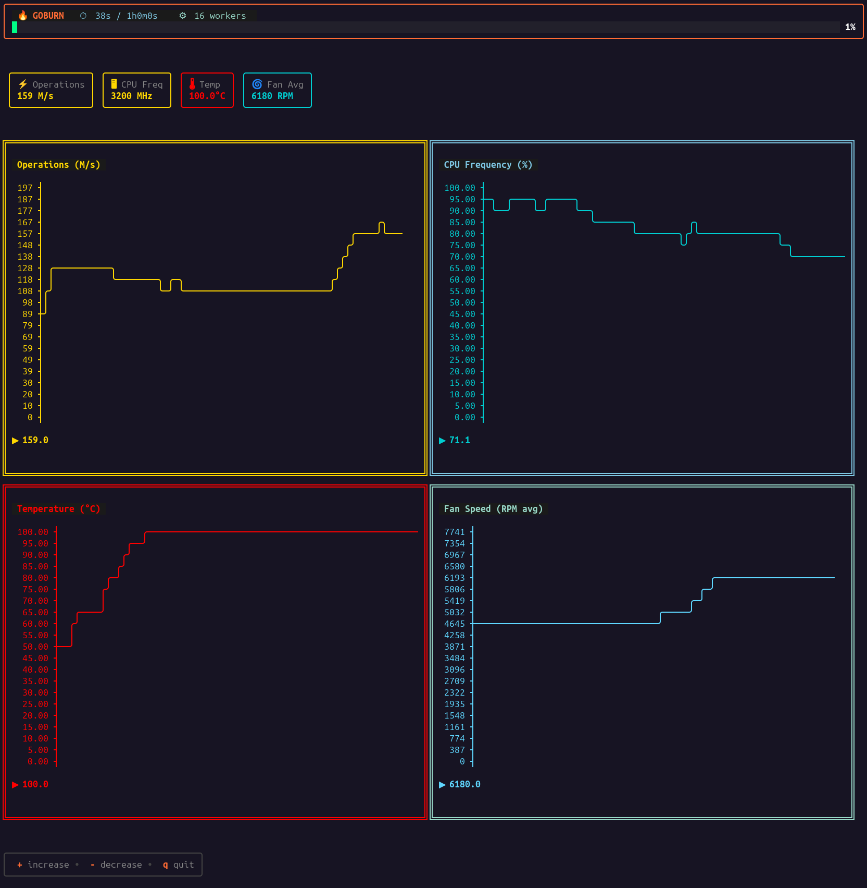

# goburn

A CPU burn testing tool with real-time hardware monitoring for Linux systems.



## Features

- **CPU Burn Testing**: Spawns configurable worker goroutines performing intensive floating-point operations
- **Hardware Monitoring**: Real-time CPU frequency, temperature, and fan speed tracking
- **Two Display Modes**:
  - **Line Mode**: Simple text output with per-second statistics
  - **Graph Mode**: Interactive TUI with live graphs and dynamic worker control

## Installation

```bash
go build -o goburn
```

## Usage

### Basic Usage

```bash
# Run for 1 minute (line mode)
./goburn -duration=1m

# Run for 2 minutes with interactive TUI
./goburn -duration=2m -graph
```

### Flags

- `-duration`: Test duration (default: 50s)
- `-graph`: Enable interactive TUI with graphs (default: false)

### Interactive Controls (Graph Mode)

- `+` or `=`: Increase worker count
- `-` or `_`: Decrease worker count
- `q` or `Ctrl+C`: Quit

## Project Structure

```
goburn/
├── main.go              # Entry point and CLI
├── hardware/
│   └── stats.go         # Hardware monitoring via Linux sysfs
├── worker/
│   └── pool.go          # Dynamic worker pool management
├── ui/
│   ├── line.go          # Simple line-based output
│   └── tui.go           # Interactive TUI with graphs
├── go.mod
└── README.md
```

## Architecture

### Package: `hardware`

Responsible for reading system hardware metrics from Linux sysfs:
- CPU frequency from `/sys/devices/system/cpu/cpu*/cpufreq/`
- Temperature from `/sys/class/thermal/` and `/sys/class/hwmon/`
- Fan speeds from `/sys/class/hwmon/*/fan*_input`

**Key Functions:**
- `Get()`: Returns current hardware statistics
- Thread-safe and efficient file reading

### Package: `worker`

Manages a dynamic pool of CPU-intensive worker goroutines:
- Workers perform floating-point math operations (`math.Pow`)
- Can dynamically add/remove workers at runtime
- Updates `runtime.GOMAXPROCS()` to match worker count
- Uses channels for graceful worker shutdown

**Key Types:**
- `Pool`: Manages worker lifecycle and shared counter

**Key Methods:**
- `New(counter, count)`: Create pool with initial workers
- `SetWorkers(n)`: Dynamically adjust worker count
- `GetActiveCount()`: Get current worker count

### Package: `ui`

Provides two user interface implementations:

#### `line.go` - Simple Mode
- Prints one line per second with current metrics
- Format: `[elapsed] ops=XM/s | cpu=X/YMHz (Z%) | temp=X.XC | fans=X,YRPM`
- Non-interactive, suitable for logging

#### `tui.go` - Interactive Mode
- Full-screen TUI using [Bubble Tea](https://github.com/charmbracelet/bubbletea)
- 2x2 grid of real-time graphs:
  - Operations per second
  - CPU frequency percentage
  - CPU temperature
  - Average fan speed
- Graphs automatically scale to terminal size
- Y-axis starts at 0, scales to theoretical maximum
- 60-second rolling history window

**Key Features:**
- Responsive layout adapts to terminal resize
- Color-coded output using [Lip Gloss](https://github.com/charmbracelet/lipgloss)
- ASCII graphs using [asciigraph](https://github.com/guptarohit/asciigraph)

## Adding New Features

### Adding a New Hardware Metric

1. Add field to `hardware.Stats` struct in `hardware/stats.go`
2. Implement getter function (follow existing patterns)
3. Call getter in `hardware.Get()`
4. Update `ui/line.go` to format new metric
5. Add graph in `ui/tui.go` if desired

### Adding a New Display Mode

1. Create new file in `ui/` package
2. Implement `Run*Mode(counter, duration, startTime, ...)` function
3. Add flag in `main.go`
4. Call from `main()` based on flag

### Modifying Worker Behavior

Edit `worker/pool.go`:
- `runWorker()`: Change CPU load algorithm
- `SetWorkers()`: Modify scaling behavior
- Add new methods for worker control

## Dependencies

- [bubbletea](https://github.com/charmbracelet/bubbletea): TUI framework
- [lipgloss](https://github.com/charmbracelet/lipgloss): Terminal styling
- [asciigraph](https://github.com/guptarohit/asciigraph): ASCII graphs

## Platform Support

Currently supports Linux only (requires sysfs for hardware monitoring).

## Performance Notes

- Each worker performs ~1 million operations before updating shared counter
- Atomic operations used for thread-safe counter updates
- Hardware stats read every second (I/O throttled)
- TUI updates at 1 Hz for smooth operation without excessive CPU usage

## License

[Add your license here]
